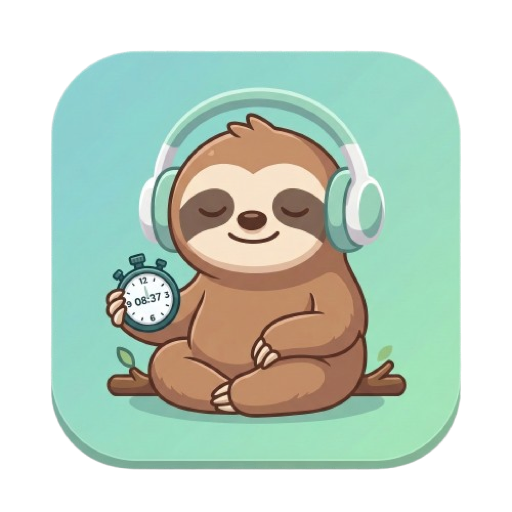

<p align="center">
  
</p>

<h1 align="center">SillyTrack</h1>

<p align="center">
  <strong>A work tracker that doesn't take itself too seriously.</strong><br/>
  <sub>macOS 13+ &middot; Native SwiftUI &middot; Auto-updates via Sparkle</sub>
</p>

<p align="center">
  <a href="https://github.com/sicmundu/silly-tracker/releases/latest"></a>
  
  
  <a href="https://github.com/sicmundu/silly-tracker/blob/main/LICENSE"></a>
</p>

---

## The pitch

You open your laptop. You start working. Hours pass. Someone asks *"what did you do today?"* and your brain returns `undefined`.

**SillyTrack** sits quietly in your menu bar, tracking time across Work / Lunch / Break, collecting your notes, syncing your Linear tasks, and generating AI summaries — so you always have an answer.

No Electron. No subscriptions. No cloud. Just a native macOS app that stores everything locally in SQLite and stays out of your way.

---

## What it looks like

```
 ┌──────────────────────────────────────────────────────────────┐
 │  TODAY FOCUS                                    1.2 / 8.0h   │
 │  Live tracking dashboard                                     │
 │                                                              │
 │       16:42:31           WORK ● 02:14:07                     │
 │       Friday afternoon   Started 14:28  ████████░░░ 28%      │
 │                                                              │
 │  ┌─────────────┐ ┌───────────┐ ┌───────────┐                │
 │  │  ■ Stop     │ │ 🍴 Lunch  │ │ ☕ Break   │                │
 │  └─────────────┘ └───────────┘ └───────────┘                │
 │                                                              │
 │  Work 2h 14m    Lunch 45m    Break 12m    3 notes            │
 ├──────────────────────────────────────────────────────────────┤
 │  ● Notes   ○ Log   ○ Stats   ○ Export          ◀ Feb 28 ▶   │
 │──────────────────────────────────────────────────────────────│
 │  ✦ AI Summary  ↻ Sync  ⊟                                    │
 │                                                              │
 │  "Worked on auth flow refactoring and reviewed              │
 │   two PRs from the frontend team."                          │
 │                                                              │
 │  14:32  Fixed race condition in WebSocket reconnect          │
 │  15:10  [Linear ENG-412] Auth token refresh logic            │
 │  15:48  PR review: cart page redesign                        │
 └──────────────────────────────────────────────────────────────┘
```

<details>
<summary><strong>Mini widget mode</strong> — a floating 304×176 widget for when you need screen space</summary>

```
 ┌─────────────────────────────────┐
 │  ◉ WORK          02:14:07   ⊞  │
 │  ████████░░ 28%                 │
 │                                 │
 │  ■ Stop   🍴 Lunch   ☕ Break   │
 └─────────────────────────────────┘
```
Floats above all windows. Click ⊞ to expand back.
</details>

<details>
<summary><strong>Menu bar</strong> — always one click away</summary>

```
          ⚡ 02:14:07  ← menu bar icon shows live timer

 ┌───────────────────────────┐
 │  WORKTRACKER              │
 │  Tracking in progress     │
 │                           │
 │  WORK ● 02:14:07          │
 │                           │
 │  Controls                 │
 │  ┌─────────────────────┐  │
 │  │ ■ Stop Work         │  │
 │  │ 🍴 Switch to Lunch  │  │
 │  │ ☕ Switch to Break   │  │
 │  └─────────────────────┘  │
 │                           │
 │  Today                    │
 │  Work      2h 14m         │
 │  Lunch     0h 45m         │
 │  Break     0h 12m         │
 └───────────────────────────┘
```
</details>

---

## Features

| | Feature | Details |
|---|---|---|
| ⏱ | **Time tracking** | Work, Lunch, Break — one click to start, auto-stops previous |
| 📝 | **Daily notes** | Capture what you're working on with quick-note chips |
| 🤖 | **AI summaries** | Anthropic Claude distills your notes into a daily recap |
| 🔄 | **Linear sync** | Auto-imports completed issues as notes (deduped, configurable interval) |
| 📊 | **Stats dashboard** | Bar charts, streaks, goal tracking, period comparisons |
| 🖥 | **Menu bar** | Live timer in menu bar with quick controls |
| 📌 | **Mini mode** | Floating widget with progress ring, stays on top |
| 💾 | **Local-first** | SQLite in Application Support, no cloud, no accounts |
| 🔄 | **Auto-updates** | Sparkle-powered updates from GitHub Releases |
| 📤 | **Export** | CSV or JSON — week, month, year, or all time |
| ⏰ | **Note reminders** | Nudges you after 45 min of work without a note |
| ❓ | **Guided tour** | Interactive onboarding overlay for new users |

---

## Install

### Download (recommended)

Grab the latest `.zip` from [**Releases**](https://github.com/sicmundu/silly-tracker/releases/latest), unzip, and drag `SillyTrack.app` to `/Applications`.

On first launch, macOS may ask you to allow it in **System Settings → Privacy & Security**.

After that, updates are delivered automatically via Sparkle.

### Build from source

```bash
git clone https://github.com/sicmundu/silly-tracker.git
cd silly-tracker

xcodebuild -project WorkTracker.xcodeproj \
  -scheme WorkTracker \
  -configuration Release \
  -derivedDataPath .build/xcode \
  build

# Copy to Applications
cp -R .build/xcode/Build/Products/Release/SillyTrack.app /Applications/
```

Requires **Xcode 15+** and **macOS 13+**.

---

## Setup

SillyTrack works out of the box for basic time tracking. Integrations are optional:

### Linear (task sync)

1. Go to [Linear Settings → API](https://linear.app/settings/api) → Create a Personal API key
2. Open SillyTrack → Settings (⌘,) → **Integrations** → Paste key → **Save**
3. Completed Linear issues will auto-sync as notes

### Anthropic (AI summaries)

1. Get an API key from [console.anthropic.com](https://console.anthropic.com/)
2. Settings → **Integrations** → Paste key → **Save**
3. Click **AI Summary** on any day with notes

---

## How it stores data

```
~/Library/Application Support/SillyTrack/
└── tracker.db          ← single SQLite file, WAL mode
```

Four tables: `entries` (time blocks), `day_notes` (your notes), `day_summaries` (AI recaps), `linear_synced_issues` (dedup tracker).

**Backup:** Settings → Data → Export (full JSON backup).
**Restore:** Settings → Data → Import.
**Reset:** Settings → Data → Reset (irreversible).

Time Machine backs up the DB automatically.

---

## Architecture

```
SillyTrackApp.swift           App entry + Sparkle controller
│
├── TrackerViewModel          @MainActor, 1-second tick, all state
│   ├── DatabaseManager       SQLite3 C API, serial queue, WAL
│   ├── LinearClient          GraphQL, paginated, deduped sync
│   └── AIClient              Anthropic Messages API (Claude)
│
├── ContentView               Main window (hero card + 4 tabs)
├── MiniWidgetView            Floating compact widget
├── MenuBarView               Menu bar extra popover
├── SettingsView              Preferences + Sparkle updater
│
└── DesignSystem              Tokens: colors, typography, spacing
    └── Components/           SectionCard, PrimaryActionButton, ...
```

**18 source files.** No frameworks beyond Sparkle and system SQLite. No Combine pipelines — just `@Published` + `Timer`.

---

## Release process

Push a version tag — CI does the rest:

```bash
git tag v1.4.0 && git push --tags
```

That's it. GitHub Actions will automatically:

1. Build the Release binary
2. Sign the ZIP with Sparkle (EdDSA)
3. Update `appcast.xml` and commit it to `main`
4. Create a GitHub Release with the ZIP attached

Users with the app installed get notified via Sparkle auto-update.

> **Manual release** (if CI is unavailable): `./scripts/release.sh <version> <build_number>`, then manually update `appcast.xml` and create a GitHub Release.

---

## Icon concept

The SillyTrack icon is a **playful mascot** — a slightly drowsy sloth wearing oversized headphones, holding a tiny stopwatch, sitting in a relaxed pose. The style is clean and rounded, with a teal-green gradient background matching the app's work accent color.

The sloth represents the *ironic self-awareness* of the app: you're tracking your productivity, but you're not taking it too seriously. The headphones say "in the zone", the stopwatch says "I'm counting", and the sloth says "...eventually."

> **For contributors:** the icon asset lives in `WorkTracker/Assets.xcassets/AppIcon.appiconset/` (directory kept as `WorkTracker` for Xcode compatibility). Replace the contents with a 1024×1024 PNG to update.

---

## License

MIT. Do whatever you want with it.
